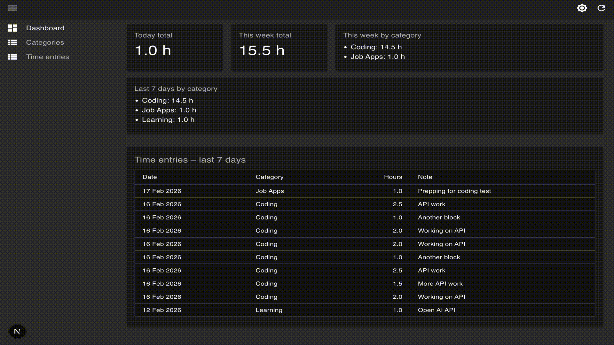

# Time Blocks Logger

---

**Time Blocks Logger** is a small time-tracking app: log time by category (e.g. Coding, Learning, Game Dev), see daily and weekly totals, and enforce a 24-hour-per-day limit so you can’t over-log a single day.

It’s built with **Next.js** (App Router), **Prisma**, **Supabase** (Postgres), **React Admin** for the admin UI, and **Zod** for validation—a good mix for practicing full-stack and admin tooling.

> **Note:** I used AI tools to help build this project, but I wanted to gain hands-on experience across the stack—Next.js, React Admin, Prisma, Supabase, and the rest—so I could learn by doing in each of those areas.

---

## Check it out



---

## What’s in the repo

- **App (Next.js):** Main app at `/`; admin UI at `/admin`.
- **Admin:** React Admin for **Categories** and **Time Entries** (list + create). A custom dashboard shows today’s and this week’s totals and recent entries.
- **APIs:** Time-entry ingestion, categories CRUD, time entries list/create, and **daily** and **weekly** totals.
- **Rules:** Categories must exist before logging time; each day is capped at 24 hours (API returns 400 if you’d exceed it).

---

## How to run

```bash
# 1. Install dependencies
npm install

# 2. Set up the database (migrations + generate client)
npx prisma migrate dev
npx prisma generate

# 3. Seed categories (required before creating time entries)
npx prisma db seed

# 4. Start the dev server
npm run dev
```

Then open:

- **App:** http://localhost:3000 (or the port shown, e.g. 3001)
- **Admin UI:** http://localhost:3000/admin

---

## Environment variables

Create a `.env` file in the project root (see `.env.example` if present, or add):

| Variable       | Required | Description |
|----------------|----------|-------------|
| `DATABASE_URL` | Yes      | Postgres connection string (e.g. Supabase connection string). |
| `SSL_CA_PATH`  | No       | Path to CA cert for SSL (e.g. Supabase). Defaults to `certs/ca.crt` if the file exists. |

For Supabase: use the connection string from **Project → Settings → Database**. If you use SSL, place the CA cert at `certs/ca.crt` or set `SSL_CA_PATH`. See `certs/README.md` for details.

---

## Seeding categories

Categories must exist before you can create time entries. The seed adds: **Coding**, **Learning**, **Game Dev**, **Building**, **Job Apps**.

```bash
npx prisma db seed
```

Seed is defined in `prisma/seeds.ts` and is idempotent (uses `skipDuplicates`).

---

## Example: create a time entry (curl)

```bash
curl -X POST http://localhost:3000/api/time-entry \
  -H "Content-Type: application/json" \
  -d '{"date":"2026-02-16","category":"Coding","durationHours":2,"note":"API work"}'
```

- **date:** `YYYY-MM-DD`
- **category:** exact category name (must exist; see seed).
- **durationHours:** number, 0.25–12, step 0.25.
- **note:** string, min 3 characters.

Response (201): `{ "data": { ... }, "dailyTotalHours": 2 }`. If the category doesn’t exist you get 404. If the day would exceed 24 hours you get 400 with `"Daily total would exceed 24 hours"`.

---

## API overview

- **POST /api/time-entry** — Ingestion by category name; returns `dailyTotalHours`.
- **GET/POST /api/categories** — List/create categories (React Admin uses these).
- **GET/POST /api/time_entries** — List/create time entries (React Admin; also `/api/time-entries`).
- **GET /api/totals/daily?date=YYYY-MM-DD** — Daily total and optional `byCategory`.
- **GET /api/totals/weekly?date=YYYY-MM-DD** — Weekly total (Mon–Sun UTC) and optional `byCategory`.

---

## Known limitations

- **Ingestion requires existing categories.** POST /api/time-entry and POST /api/time-entries do not create categories; use the seed or create them via the admin (or POST /api/categories).
- **No edit/delete in the admin.** Only list and create are implemented for categories and time entries. Edit/delete would require additional API routes and resource props.
- **24h/day guard.** Creating a time entry is rejected with 400 if that day’s total would exceed 24 hours.
- **Admin list responses.** GET /api/categories and GET /api/time_entries return a **raw array** (and `Content-Range` header) for React Admin’s simple REST provider. Other clients can use the same endpoints; total is in `Content-Range`.

---

## Tech used

- **Next.js 15** (App Router, Turbopack in dev)
- **React 19**
- **Prisma 7** + **Supabase** (Postgres)
- **React Admin** + **ra-data-simple-rest**
- **Zod** (validation), **date-fns** (dates), **Material UI** (admin dashboard)

---

If you clone this and run it, you’ll need a Postgres DB (e.g. Supabase) and the env vars above. Have fun tweaking it.
