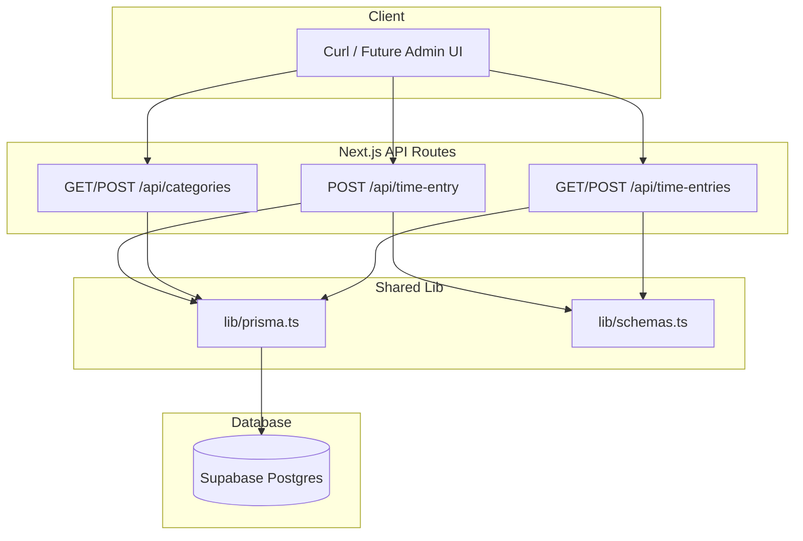

# Hour 2: API Routes + Validation + Curl Testing — Extended Plan

This plan implements Hour 2 for [Time_Blocks](file:///Users/guymarshman/Dev/Back_End_Dev/Github/Time_Blocks), building on the existing Prisma 7.4 + Supabase foundation. No Next.js exists yet; scaffolding it is the first step.

---

## Current Project State

- **Prisma 7.4**: [prisma.config.ts](file:///Users/guymarshman/Dev/Back_End_Dev/Github/Time_Blocks/prisma.config.ts), [schema.prisma](file:///Users/guymarshman/Dev/Back_End_Dev/Github/Time_Blocks/prisma/schema.prisma)
- **Seeds**: [prisma/seeds.ts](file:///Users/guymarshman/Dev/Back_End_Dev/Github/Time_Blocks/prisma/seeds.ts) uses `@prisma/adapter-pg` + SSL/CA logic for Supabase
- **Models**: `Category` (id, name, createdAt), `TimeEntry` (id, date, categoryId, durationHours, note, createdAt)
- **Env**: `DATABASE_URL`, optional `SSL_CA_PATH` (defaults to `certs/ca.crt` per [certs/README.md](file:///Users/guymarshman/Dev/Back_End_Dev/Github/Time_Blocks/certs/README.md))
- **Dependencies**: zod ^4.3.6, date-fns, react-admin, ra-data-simple-rest; **dotenv** not in package.json (add if missing)

---

## Phase 0: Next.js Scaffold

**Action:** Run from project root:

```bash
npx create-next-app@latest . --typescript --eslint --app --src-dir=false --import-alias="@/*" --turbopack
```

When prompted about existing files (e.g. package.json), choose to merge/keep. Ensure existing deps (prisma, zod, date-fns, etc.) remain. Add `dotenv` if not present: `npm install dotenv`.

**Outcome:** `app/`, `lib/` (or create it), `next.config.*`, `tsconfig.json`, dev script.

---

## Phase 1: Prisma Client Singleton

**File:** [lib/prisma.ts](file:///Users/guymarshman/Dev/Back_End_Dev/Github/Time_Blocks/lib/prisma.ts) (create)

Reuse the SSL/adapter pattern from [prisma/seeds.ts](file:///Users/guymarshman/Dev/Back_End_Dev/Github/Time_Blocks/prisma/seeds.ts) (lines 7–31). Extract or duplicate:

- `connectionString` from `process.env.DATABASE_URL`
- CA cert path: `process.env.SSL_CA_PATH || path.join(process.cwd(), "certs", "ca.crt")`
- SSL config: `{ rejectUnauthorized: true, ca: fs.readFileSync(caPath).toString() }` when cert exists
- URL stripping of SSL params when using custom CA (same logic as seeds)
- `PrismaPg` adapter with `connectionString` and optional `ssl`
- `PrismaClient({ adapter })`

Add dev hot-reload guard:

```ts
const globalForPrisma = globalThis as unknown as { prisma: PrismaClient };
export const prisma = globalForPrisma.prisma ?? new PrismaClient({ adapter });
if (process.env.NODE_ENV !== "production") globalForPrisma.prisma = prisma;
```

Ensure `import "dotenv/config"` at top so `DATABASE_URL` is available in API routes.

---

## Phase 2: Zod Schemas

**File:** [lib/schemas.ts](file:///Users/guymarshman/Dev/Back_End_Dev/Github/Time_Blocks/lib/schemas.ts) (create)

Use Zod v4 syntax (project has zod ^4.3.6):

**TimeEntryCreateSchema**


| Field         | Rule                                                                            |
| ------------- | ------------------------------------------------------------------------------- |
| date          | `z.string().regex(/^\d{4}-\d{2}-\d{2}$/, "Invalid YYYY-MM-DD")`                 |
| category      | `z.string().min(2)`                                                             |
| durationHours | `z.number().min(0.25).max(12).refine(v => v % 0.25 === 0, "Must be 0.25 step")` |
| note          | `z.string().min(3)`                                                             |


**CategoryCreateSchema**

- `z.object({ name: z.string().min(1) })`

Export schemas and inferred types: `z.infer<typeof TimeEntryCreateSchema>`.

---

## Phase 3: Ingestion Endpoint

**File:** [app/api/time-entry/route.ts](file:///Users/guymarshman/Dev/Back_End_Dev/Github/Time_Blocks/app/api/time-entry/route.ts) (create)

**Method:** POST only. Return `NextResponse.json({ error: "Method not allowed" }, { status: 405 })` for others.

**Flow:**

1. `const body = await request.json()`
2. `TimeEntryCreateSchema.safeParse(body)` — on failure: `400`, `{ error: "Validation failed", details: result.error.flatten() }`
3. `prisma.category.findFirst({ where: { name: body.category } })` — if null: `404`, `{ error: "Category not found: " + body.category }`
4. Convert date: `new Date(body.date + "T00:00:00.000Z")` (UTC start of day) or local equivalent
5. `prisma.timeEntry.create({ data: { date, categoryId: category.id, durationHours: body.durationHours, note: body.note } })`
6. `prisma.timeEntry.aggregate({ where: { date }, _sum: { durationHours: true } })` — `dailyTotalHours = _sum.durationHours ?? 0`
7. Return `201`: `{ data: createdEntry, dailyTotalHours }`

**Date handling:** Prisma `DateTime` stores full timestamp. Use consistent normalization (e.g. UTC midnight) for `where: { date }` aggregation. Ensure client sends `YYYY-MM-DD`.

---

## Phase 4: REST Endpoints for React Admin

### 4a. Categories

**File:** [app/api/categories/route.ts](file:///Users/guymarshman/Dev/Back_End_Dev/Github/Time_Blocks/app/api/categories/route.ts)

**GET**

- `prisma.category.findMany()`
- Response: `{ data: categories, total: categories.length }` (ra-data-simple-rest expects this shape)

**POST**

- Body: `{ name }`
- `CategoryCreateSchema.safeParse(body)` — 400 on failure
- `prisma.category.create({ data: { name } })`
- Response: `201`, `{ data: createdCategory }`

### 4b. Time Entries

**File:** [app/api/time-entries/route.ts](file:///Users/guymarshman/Dev/Back_End_Dev/Github/Time_Blocks/app/api/time-entries/route.ts)

**GET**

- Query: `searchParams.get("date")`, `searchParams.get("categoryId")`
- Build `where`: `date` as Date (from YYYY-MM-DD), `categoryId` as number if provided
- `prisma.timeEntry.findMany({ where, include: { category: true }, orderBy: { createdAt: "desc" } })`
- Map each entry to include `categoryName: entry.category.name` (or equivalent) so React Admin can display it
- Response: `{ data: entries, total: entries.length }`

**POST**

- Body: `{ date, category?, categoryId?, durationHours, note }`
- Resolve category: by `categoryId` or by `category` (name). If by name and not found: 404
- Validate with `TimeEntryCreateSchema` (adapt input to include `category` from name if needed)
- Create TimeEntry, return `201`, `{ data: createdEntry }`

---

## Phase 5: Curl Verification

Run `npm run dev`, then execute:

```bash
# 1. Valid ingestion
curl -X POST http://localhost:3000/api/time-entry \
  -H "Content-Type: application/json" \
  -d '{"date":"2026-02-16","category":"Coding","durationHours":2,"note":"Working on API"}'
# Expect: 201, dailyTotalHours: 2

# 2. Second entry same day
curl -X POST http://localhost:3000/api/time-entry \
  -H "Content-Type: application/json" \
  -d '{"date":"2026-02-16","category":"Coding","durationHours":1.5,"note":"More API work"}'
# Expect: 201, dailyTotalHours: 3.5

# 3. Invalid category
curl -X POST http://localhost:3000/api/time-entry \
  -H "Content-Type: application/json" \
  -d '{"date":"2026-02-16","category":"Unknown","durationHours":1,"note":"Test note"}'
# Expect: 404, error: "Category not found: Unknown"

# 4. Validation error
curl -X POST http://localhost:3000/api/time-entry \
  -H "Content-Type: application/json" \
  -d '{"date":"2026-02-16","category":"Coding","durationHours":0.1,"note":"Bad"}'
# Expect: 400, validation details

# 5. GET categories
curl http://localhost:3000/api/categories
# Expect: { data: [...], total: N }

# 6. GET time-entries
curl "http://localhost:3000/api/time-entries?date=2026-02-16"
# Expect: { data: [entries with categoryName], total }
```

---

## Deliverables Checklist

- Next.js scaffolded, dev server runs
- `lib/prisma.ts` with adapter-pg + SSL, singleton pattern
- `lib/schemas.ts` with TimeEntryCreateSchema, CategoryCreateSchema
- POST /api/time-entry: validation, category lookup, insert, daily total
- GET/POST /api/categories
- GET/POST /api/time-entries with date/categoryId filters, categoryName in list
- All 6 curl tests pass

---

## Data Flow




