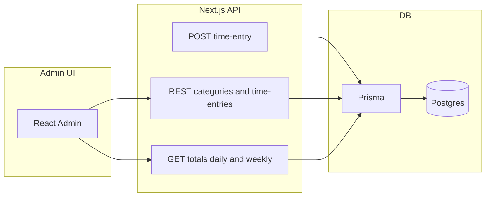

# Time Blocks Logger — implementation plan

**Stack:** Next.js (App Router), Prisma 7.4, Supabase (Postgres), Zod, React Admin.

**Current state:** Prisma 7.4 configured with `prisma.config.ts`, schema, migrations, and `prisma/seeds.ts` (categories seeded). No Next.js yet — Hour 2 requires scaffolding it first.

**Ingestion behavior:** POST /api/time-entry will **require pre-existing categories**; if the submitted category name does not match an existing category, the request will fail with validation error (no upsert).

---

## Pre-setup (5–10 min)

- **Scaffold Next.js + TypeScript** in the repo root (replace or migrate current package.json).
- **Add dependencies:** `prisma`, `@prisma/client`, `zod`, `react-admin`, `ra-data-simple-rest`, `date-fns` (optional).
- **Add `.env**` (or `.env.local`) with:
  - `DATABASE_URL` — Supabase Postgres connection string
  - Optional: Supabase service role key if needed later for server-side DB access
- **Add `.env.local` to `.gitignore**` if not already.

---

## Hour 1: Supabase + Prisma foundation

**1) Supabase**  
Create project in Supabase, copy Postgres connection string into `DATABASE_URL`. No code changes.

**2) Prisma schema**  
Create `prisma/schema.prisma` with:

- **Category:** `id` (autoincrement), `name` (String, unique), `createdAt` (DateTime).
- **TimeEntry:** `id`, `date` (DateTime, date only), `categoryId` (FK → Category), `durationHours` (Float), `note` (String), `createdAt`.
- Relation: `TimeEntry` belongs to `Category`; `Category` has many `TimeEntry`.
- Indexes: `@@index([date])`, `@@index([categoryId])`, optional `@@index([date, categoryId])`.

**3) Migrate and seed**  

- `npx prisma migrate dev --name init` (or equivalent).
- Seed script in `prisma/seed.ts`: insert categories: **Coding, Learning, Game Dev, Building, Job Apps**.
- Add `prisma.seed` in `package.json` and run `npx prisma db seed`.
- Quick sanity: small script or one-off query to list categories (e.g. in seed or a tiny API route) to confirm DB connectivity.

**Deliverable:** Migrations apply, seed runs, categories are queryable.

---

## Hour 2: API routes + validation + curl testing

**1) Prisma client singleton**  
Add `lib/prisma.ts` (or `src/lib/prisma.ts` depending on Next.js layout) that instantiates `PrismaClient` and reuses it in dev to avoid hot-reload connection exhaustion.

**2) Zod schemas**  
Create shared validation (e.g. `lib/schemas.ts` or next to API):

- **TimeEntryCreateSchema:**  
  - `date`: string, valid `YYYY-MM-DD`.  
  - `category`: string, min length 2 (category *name* for ingestion).  
  - `durationHours`: number, ≥ 0.25, ≤ 12, step 0.25 (e.g. custom refine).  
  - `note`: string, min length 3.

**3) Ingestion endpoint: POST /api/time-entry**  

- Parse and validate body with Zod.
- **Category handling:** Look up category by `name`; if not found, return **4xx + message** (e.g. “Category not found: X”). No creation/upsert.
- Insert `TimeEntry` with resolved `categoryId`.
- Compute daily total for that `date`: `sum(durationHours)`.
- Response: `{ data: createdEntry, dailyTotalHours }` (or similar).

**4) REST endpoints for React Admin**  
Implement “simple REST” style so `ra-data-simple-rest` can talk to the app:

- **GET /api/categories** — list; respond with `{ data: Category[], total: number }`.
- **POST /api/categories** — create; body `{ name }`; respond `{ data: createdCategory }`.
- **GET /api/time-entries** — list with optional query `date`, `categoryId`; respond `{ data: TimeEntry[], total: number }`. Include category name in each row (e.g. join or populate).
- **POST /api/time-entries** — create; validate with Zod; resolve category by id or name per your resource shape; respond `{ data: createdEntry }`.

Optional later: PUT/DELETE for categories and time-entries if time permits.

**5) Curl testing**  

- Create a time entry (category that exists).  
- Create another same day + same category.  
- Assert response `dailyTotalHours` increases as expected.  
- Send invalid payload (e.g. bad duration, missing category) and confirm validation errors.

**Deliverable:** Ingestion works with pre-existing categories only; list/create REST endpoints exist; validation rejects bad input.

---

## Hour 3: React Admin app wiring (minimal UI)

**1) Admin route**  
Add route (e.g. `app/admin/page.tsx` in App Router or `pages/admin/index.tsx` in Pages Router) that renders the React Admin `<Admin>` component with a data provider.

**2) Data provider**  
Use `ra-data-simple-rest` pointing at your API base (e.g. `/api`). Ensure:

- List responses: `{ data: [...], total: number }`.  
- Create responses: `{ data: createdRecord }`.  
- Provider is configured with `httpClient` if needed (e.g. fetch to same origin).

**3) Resources**  

- **Resource 1: Categories**  
  - List: show `name`.  
  - Create: form with `name` (and any required fields).
- **Resource 2: Time Entries**  
  - List: columns for `date`, category name, `durationHours`, `note`, `createdAt`.  
  - Ensure API returns category name for each entry (e.g. in GET /api/time-entries).

**Deliverable:** Admin loads; categories and time entries are viewable (list + create from admin if POST is wired).


---

## Hour 4: Forms + filters + duration dropdown

**1) TimeEntry create form**  

- Fields: date (default today), category (select from categories resource), duration (dropdown), note (textarea).  
- Duration options: 0.25 to 8.0 in 0.25 steps (or 0.25–12 if you keep 12 in validation).

**2) List filters**  

- Time entries list: filter by exact **date** and by **category** (dropdown).

**3) UX**  

- Default sort: newest first.  
- Note column: allow wrap / reasonable width.  
- Keep Create form easy to reach (e.g. prominent “Create” in list toolbar).

**Deliverable:** Full create flow in admin; date and category filters; duration constrained to valid steps.

---

## Hour 5: Totals + dashboard + polish

**1) Totals API**  

- **GET /api/totals/daily?date=YYYY-MM-DD**  
  - Return `dailyTotalHours` and optionally `byCategory: [{ name, hours }]`.
- **GET /api/totals/weekly?date=YYYY-MM-DD**  
  - Treat `date` as any day in the week; compute Monday–Sunday (or your chosen week bounds) with `date-fns`; return `weeklyTotalHours` and optional `byCategory`.

**2) Admin dashboard**  

- Simple dashboard component (custom route or admin home):  
  - Card: “Today total” (call daily totals for today).  
  - Card: “This week total” (call weekly totals for today).  
  - Optional: breakdown by category for the week.

**3) Validation polish**  

- In POST /api/time-entry (and optionally POST /api/time-entries): before inserting, compute current `sum(durationHours)` for that date; if `currentSum + newDuration > 24`, reject with clear message (e.g. 400 “Daily total would exceed 24 hours”).

**4) README**  

- How to run (install, `prisma migrate`, `prisma db seed`, `npm run dev`).  
- Env vars (DATABASE_URL, etc.).  
- How to seed categories.  
- Example curl for POST /api/time-entry.  
- Known limitations (e.g. no edit/delete if skipped, ingestion requires existing categories).

**Deliverable:** Daily and weekly totals in API and dashboard; 24h/day guard; README for handover/interview.

---

## Shortcuts (per your plan)

- **Skip edit/delete** for both resources unless time allows.  
- **Ingestion:** Fail if category missing; no auto-create (already decided).

---

## Suggested file layout (App Router)

```text
app/
  admin/
    page.tsx          # React Admin shell + resources
  api/
    categories/
      route.ts        # GET, POST
    time-entry/
      route.ts        # POST ingestion
    time-entries/
      route.ts        # GET, POST
    totals/
      daily/
        route.ts      # GET
      weekly/
        route.ts      # GET
lib/
  prisma.ts
  schemas.ts          # Zod schemas
prisma/
  schema.prisma
  seed.ts
.env.local
README.md
```

If you use Pages Router, equivalent: `pages/api/...` and `pages/admin/...`.

---

## Data flow (high level)




No implementation work will be done until you confirm; this plan is ready to execute step by step (e.g. hour by hour) when you want to start building.